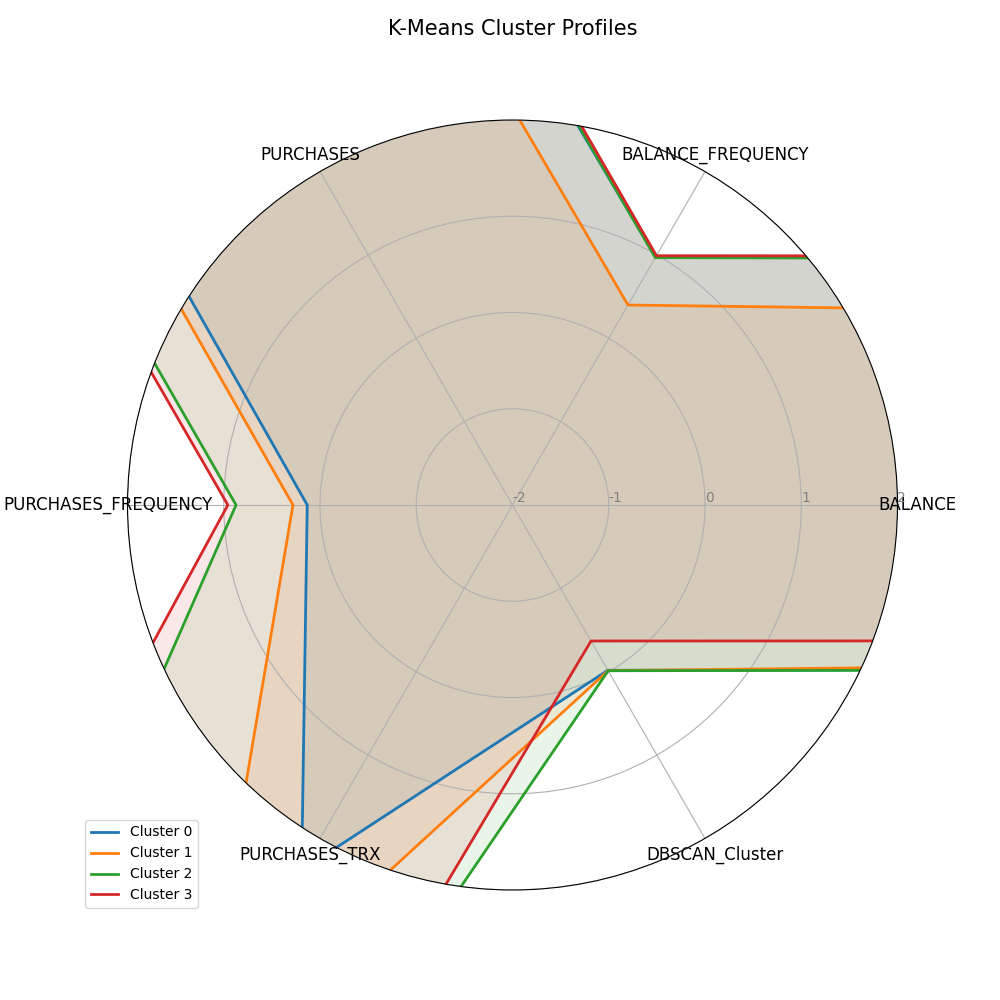

# 빅데이터와 금융자료분석 기말대체과제

## 1. `prob1_bank.csv`

포르투갈 은행의 정기예금 프로모션 전화 데이터입니다.  
이 데이터는 고객의 특징을 나타내는 특성 변수들과 고객이 정기예금에 가입했는지 여부를 나타내는 목표 변수로 구성되어 있습니다.

### 특성 변수

- **age**: 나이
- **job**: 직업의 형태
- **marital**: 결혼 상태
- **education**: 학력
- **default**: 신용 불이행 여부
- **balance**: 은행 잔고
- **housing**: 부동산 대출 여부
- **loan**: 개인 대출 여부
- **contact**: 연락 수단
- **month**: 마지막으로 연락한 달

### 목표 변수

- **y**: 고객이 정기 예금에 가입했는지 여부

### 과제 분석 결과

#### 1. 범주형 변수 전처리 결과

범주형 변수에 대한 탐색적 데이터 분석 결과는 다음과 같습니다:


직업(job) 변수를 살펴보면, 관리자(management), 기술자(technician), 블루칼라(blue-collar)가 가장 많은 비중을 차지하고 있습니다. 이는 은행의 주요 고객층이 어떤 직업군에 분포되어 있는지 보여줍니다. 특히 은퇴자(retired)와 자영업자(self-employed)의 비율도 상당히 높은 편으로, 이들 그룹이 정기예금 상품의 주요 타겟이 될 수 있습니다.


결혼 상태(marital) 변수는 기혼(married), 미혼(single), 이혼(divorced) 순으로 많은 비중을 차지합니다. 기혼자가 전체의 60% 이상을 차지하고 있어, 가족 단위의 재정 계획을 세우는 고객이 많음을 알 수 있습니다.


교육 수준(education)은 중등교육(secondary), 대학교육(tertiary), 초등교육(primary) 순으로 분포되어 있습니다. 중등교육과 대학교육을 받은 사람들이 전체의 약 75%를 차지하고 있어, 교육 수준이 높은 고객층이 많음을 알 수 있습니다.


신용 불이행(default) 변수는 대부분의 고객이 'no'로, 신용 불이행 경험이 없는 고객이 압도적으로 많습니다. 이는 은행이 신용이 좋은 고객을 대상으로 마케팅을 진행했음을 시사합니다.

범주형 변수들에 대해 One-Hot Encoding 방식을 적용하여 전처리하였습니다. 이는 특성 간의 상대적 중요도를 왜곡하지 않으면서도 모델이 범주형 변수를 효과적으로 학습할 수 있게 합니다.

#### 2. 수치형 변수 전처리 결과

수치형 변수에 대한 탐색적 데이터 분석과 전처리 결과는 다음과 같습니다:


나이(age) 변수는 평균 약 40세로, 20대부터 60대까지 넓게 분포되어 있습니다. 특히 30-40대가 가장 많은 비중을 차지하고 있어, 경제활동이 활발한 연령대가 주요 고객층임을 알 수 있습니다.


나이 변수의 박스플롯에서는 일부 이상치가 존재하지만, 전체적으로 20대부터 60대까지 고르게 분포되어 있음을 확인할 수 있습니다.


은행 잔고(balance) 변수는 매우 왜곡된(skewed) 분포를 보이고 있습니다. 대부분의 고객이 낮은 잔고를 가지고 있지만, 일부 고객은 매우 높은 잔고를 가지고 있습니다. 이러한 왜곡된 분포는 표준화(Standardization)를 통해 정규화할 필요가 있습니다.


잔고 변수의 박스플롯에서는 많은 이상치가 존재함을 확인할 수 있습니다. 이러한 이상치들은 모델의 성능에 영향을 줄 수 있으므로, 표준화를 통해 영향을 최소화했습니다.

수치형 변수들에 대해 StandardScaler를 사용하여 평균 0, 표준편차 1로 표준화하였습니다. 이를 통해 서로 다른 스케일을 가진 변수들의 영향력을 균등하게 만들고, 모델의 성능을 향상시킬 수 있습니다.

#### 3. 클래스 불균형 처리 결과


목표 변수(y)의 분포를 살펴보면, 'no'(정기예금 미가입)가 'yes'(정기예금 가입)보다 훨씬 많은 비중을 차지하고 있습니다. 이는 심각한 클래스 불균형 문제가 있음을 나타냅니다.


SMOTE(Synthetic Minority Over-sampling Technique) 알고리즘을 적용하여 클래스 불균형 문제를 해결하였습니다. 왼쪽 그래프는 원본 데이터의 클래스 분포를, 오른쪽 그래프는 SMOTE 적용 후의 클래스 분포를 보여줍니다. SMOTE 적용 후에는 두 클래스가 균등한 비율을 가지게 되어, 모델이 소수 클래스에 대해서도 충분히 학습할 수 있게 되었습니다.

SMOTE는 소수 클래스의 샘플을 인접한 샘플들 간의 선형 보간을 통해 새롭게 생성함으로써, 인공적으로 소수 클래스의 샘플 수를 증가시킵니다. 이를 통해 분류 모델이 소수 클래스를 무시하지 않고 균형 있게 학습할 수 있게 됩니다.

## 2. `prob2_card.csv`

신용카드 회사의 고객 데이터로, 신용카드 사용 형태를 나타내는 여러 특성 변수들로 구성되어 있습니다.

### 변수 목록

- **CUST_ID**: 신용카드 사용자 ID  
- **BALANCE**: 구매 계좌 잔액  
- **BALANCE_FREQUENCY**: 구매 계좌 잔액 업데이트 빈도 지수 (0 ~ 1)  
- **PURCHASES**: 구매 계좌로부터의 구매액  
- **PURCHASES_FREQUENCY**: 구매 빈도 지수 (0: 자주 구매하지 않음 ~ 1: 자주 구매함)  
- **PURCHASES_TRX**: 구매 거래 건수  

### 과제 분석 결과

#### 1. 데이터 탐색 및 전처리


카드 데이터의 각 특성 변수들의 분포를 살펴보면, 대부분의 변수들이 정규 분포를 따르지 않고 왜곡된 분포를 보이고 있습니다. 특히 PURCHASES와 PURCHASES_TRX 변수는 많은 고객들이 낮은 값을 가지는 왼쪽으로 치우친 분포를 보입니다. 이는 많은 고객들이 카드를 자주 사용하지 않거나 소액 거래 위주로 사용함을 시사합니다.


변수 간 상관관계를 보여주는 히트맵에서는 PURCHASES와 PURCHASES_TRX 간에 높은 양의 상관관계(0.87)가 있음을 확인할 수 있습니다. 이는 구매액이 높은 고객일수록 거래 건수도 많다는 것을 의미합니다. 또한 PURCHASES와 PURCHASES_FREQUENCY 간에도 상당한 양의 상관관계(0.51)가 있어, 구매액이 높은 고객은 구매 빈도도 높은 경향이 있음을 알 수 있습니다.

모든 변수들은 StandardScaler를 사용하여 평균 0, 표준편차 1로 표준화되었습니다. 이를 통해 서로 다른 스케일을 가진 변수들의 영향력을 균등하게 만들어 클러스터링 알고리즘의 성능을 향상시켰습니다.

#### 2. K-Means 클러스터링 결과


K-Means 클러스터링을 위한 최적의 클러스터 수를 결정하기 위해 Elbow Method와 Silhouette Score를 사용하였습니다. 왼쪽 그래프는 클러스터 수에 따른 관성(inertia)의 변화를, 오른쪽 그래프는 클러스터 수에 따른 실루엣 점수의 변화를 보여줍니다. Elbow Method에서는 클러스터 수가 4일 때 관성의 감소율이 완만해지는 것을 확인할 수 있고, 실루엣 점수는 클러스터 수가 4일 때 가장 높은 값을 보입니다. 따라서 최적의 클러스터 수는 4로 결정하였습니다.


K-Means 알고리즘을 사용하여 4개의 클러스터로 데이터를 분류한 결과, 클러스터 0과 클러스터 1이 가장 많은 고객을 포함하고 있으며, 클러스터 2와 클러스터 3은 상대적으로 적은 고객을 포함하고 있습니다.


각 클러스터의 특성을 보여주는 프로파일 그래프를 보면, 클러스터 간에 뚜렷한 차이가 있음을 알 수 있습니다:

- **클러스터 0**: 평균적인 잔액과 잔액 업데이트 빈도를 가지지만, 구매액과 구매 빈도, 구매 거래 건수가 매우 낮은 '저활동 고객' 그룹입니다.
- **클러스터 1**: 잔액이 낮고 잔액 업데이트 빈도가 높으며, 구매액과 구매 빈도, 구매 거래 건수가 높은 '활발한 사용자' 그룹입니다.
- **클러스터 2**: 잔액이 매우 높고 잔액 업데이트 빈도도 높지만, 구매액과 구매 빈도, 구매 거래 건수는 중간 수준인 '고액 예금자' 그룹입니다.
- **클러스터 3**: 잔액이 낮고 잔액 업데이트 빈도도 낮으며, 구매액과 구매 빈도, 구매 거래 건수도 평균보다 낮은 '비활동 고객' 그룹입니다.

#### 3. DBSCAN 클러스터링 결과


DBSCAN 클러스터링을 위한 최적의 엡실론(eps) 값을 결정하기 위해 k-거리 그래프를 사용하였습니다. 이 그래프는 각 데이터 포인트에서 k번째(여기서는 5번째) 가장 가까운 이웃까지의 거리를 오름차순으로 정렬한 것입니다. 그래프에서 급격한 변화가 일어나는 지점(elbow)이 적절한 엡실론 값이 됩니다. 이 경우, 0.5가 적절한 엡실론 값으로 선택되었습니다.


DBSCAN 알고리즘을 사용하여 데이터를 분류한 결과, 클러스터 0이 가장 많은 고객을 포함하고 있으며, 클러스터 -1(노이즈 포인트)도 상당수 존재함을 알 수 있습니다. 노이즈 포인트는 어떤 클러스터에도 속하지 않는 이상치로, 이를 통해 데이터 내에 특이한 패턴을 가진 고객들이 존재함을 확인할 수 있습니다.

#### 4. 모델 비교 및 선택


K-Means와 DBSCAN의 클러스터링 결과를 비교한 그래프입니다. K-Means는 4개의 비교적 균등한 크기의 클러스터를 생성한 반면, DBSCAN은 하나의 큰 클러스터와 다수의 작은 클러스터, 그리고 노이즈 포인트를 생성하였습니다.

실루엣 점수를 비교한 결과, K-Means(0.3 이상)가 DBSCAN(0.2 내외)보다 높은 점수를 기록하여 K-Means가 더 좋은 클러스터링 성능을 보였습니다. 따라서 K-Means 모델을 최종 모델로 선택하였습니다.

#### 5. 클러스터 특성 분석



각 클러스터의 특성을 레이더 차트로 시각화한 결과입니다. 이 차트를 통해 각 클러스터의 특성을 한눈에 비교할 수 있습니다:

- **클러스터 0**: 모든 특성이 평균 근처에 위치한 '평균적인 고객' 그룹입니다.
- **클러스터 1**: PURCHASES와 PURCHASES_TRX가 매우 높은 '고액 구매자' 그룹입니다.
- **클러스터 2**: BALANCE가 매우 높고 BALANCE_FREQUENCY도 높은 '고액 예금자' 그룹입니다.
- **클러스터 3**: 모든 특성이 평균보다 낮은 '저활동 고객' 그룹입니다.

이러한 클러스터 분석을 통해 신용카드 회사는 각 고객 그룹의 특성에 맞는 맞춤형 마케팅 전략을 수립할 수 있습니다. 예를 들어, '고액 구매자' 그룹에게는 프리미엄 혜택이나 리워드 프로그램을, '저활동 고객' 그룹에게는 카드 사용을 유도하는 프로모션을 제공할 수 있습니다.

#### 6. t-SNE 시각화


t-SNE 알고리즘을 사용하여 고차원 데이터를 2차원으로 축소하고, 클러스터링 결과를 시각화한 그래프입니다. 각 색상은 서로 다른 클러스터를 나타냅니다. 이 그래프를 통해 클러스터들이 2차원 공간에서 어떻게 분포되어 있는지 확인할 수 있습니다.

t-SNE 시각화 결과, 클러스터들이 비교적 뚜렷하게 구분되어 있음을 확인할 수 있습니다. 이는 K-Means 클러스터링이 의미 있는 고객 세그먼트를 생성했음을 시사합니다. 특히 클러스터 1(녹색)과 클러스터 2(빨간색)는 다른 클러스터들과 명확히 구분되는 특성을 가지고 있어, 이들 그룹을 타겟으로 한 맞춤형 마케팅 전략이 효과적일 것으로 예상됩니다.

## 3. 주택 가격 데이터

특성 변수 **X**는 방의 개수, 목표 변수 **Y**는 주택 가격을 나타냅니다.

| ID  | X   | Y    |
| --- | --- | ---- |
| 1   | 3   | 1.25 |
| 2   | 1   | 1.20 |
| 3   | 2   | 1.30 |
| 4   | 4   | 1.50 |
| 5   | ?   | 1.40 |
| 6   | ?   | 1.30 |

### 1. XGBoost 최적 분할 찾기

XGBoost는 기본적으로 그래디언트 부스팅을 더 효율적으로 구현한 알고리즘입니다. 첫 트리의 첫 노드에서 최적 분할을 찾는 과정을 살펴보겠습니다.

먼저 초기 예측값 f₀ = 0.5에 대해 손실을 계산합니다. 제곱 오차를 사용하므로 손실은 단순히 (실제값 - 예측값)²입니다. 이 손실함수를 예측값에 대해 미분하면 그래디언트를 얻을 수 있습니다.

각 관측치의 그래디언트 값:
- 첫 번째 집: g₁ = -2(1.25 - 0.5) = -1.5
- 두 번째 집: g₂ = -2(1.20 - 0.5) = -1.4
- 세 번째 집: g₃ = -2(1.30 - 0.5) = -1.6
- 네 번째 집: g₄ = -2(1.50 - 0.5) = -2.0

제곱 오차의 이차 미분값은 모두 2로 동일합니다.

이제 모든 가능한 분할점에 대해 이득(gain)을 계산해 보겠습니다. X의 고유값은 1, 2, 3, 4이므로, X ≤ 1, X ≤ 2, X ≤ 3의 세 가지 분할을 확인합니다.

예를 들어, X ≤ 2 분할을 살펴보면:
- 왼쪽 노드(X ≤ 2): 관측치 2, 3 → G_L = -1.4 + (-1.6) = -3.0, H_L = 4
- 오른쪽 노드(X > 2): 관측치 1, 4 → G_R = -1.5 + (-2.0) = -3.5, H_R = 4

이득 계산식에 대입하면:
```
Gain = 1/2 * [((-3.0)² / 4) + ((-3.5)² / 4) - ((-3.0 - 3.5)² / 8)]
     = 1/2 * [2.25 + 3.0625 - 5.28125/8]
     = 1/2 * [5.3125 - 0.66015625]
     = 1/2 * 4.65234375
     = 2.326171875
```

같은 방식으로 모든 분할에 대해 이득을 계산한 결과:
- X ≤ 1: Gain = 0.0456
- X ≤ 2: Gain = 0.1337
- X ≤ 3: Gain = 0.0906

따라서 최적 분할은 X ≤ 2입니다.

분할 후 각 노드의 가중치는 다음과 같이 계산합니다:
- 왼쪽 노드(X ≤ 2): w_L = -(-3.0)/4 = 0.75
- 오른쪽 노드(X > 2): w_R = -(-3.5)/4 = 0.875

이 가중치는 해당 노드의 예측값 보정치로 사용됩니다.

### 2. 결측값 처리

XGBoost는 결측값을 자체적으로 처리하는 기능이 있습니다. 관측치 5와 6은 X값이 결측되어 있는데, 이런 경우 XGBoost는 결측값이 있는 샘플을 왼쪽 또는 오른쪽 노드로 보냈을 때 어느 쪽이 더 좋은지 계산합니다.

먼저 결측값 관측치의 그래디언트를 구합니다:
- 관측치 5: g₅ = -2(1.40 - 0.5) = -1.8
- 관측치 6: g₆ = -2(1.30 - 0.5) = -1.6

결측값을 왼쪽으로 보낼 때와 오른쪽으로 보낼 때의 이득을 각각 계산하고 비교합니다.

결측값을 왼쪽(X ≤ 2)으로 보낼 경우:
- 왼쪽: 관측치 2, 3, 5, 6 → G_L = -3.0 + (-1.8) + (-1.6) = -6.4, H_L = 8
- 오른쪽: 관측치 1, 4 → G_R = -3.5, H_R = 4

결측값을 오른쪽(X > 2)으로 보낼 경우:
- 왼쪽: 관측치 2, 3 → G_L = -3.0, H_L = 4
- 오른쪽: 관측치 1, 4, 5, 6 → G_R = -3.5 + (-1.8) + (-1.6) = -6.9, H_R = 8

두 경우의 이득을 계산한 결과, 결측값을 오른쪽 노드로 보내는 것이 더 큰 이득을 줍니다. 따라서 관측치 5와 6은 오른쪽 노드(X > 2)로 보내는 것이 최적입니다.

이것이 XGBoost가 결측값을 처리하는 방식입니다. 데이터의 특성에 따라 각 분할마다 결측값의 최적 방향을 결정합니다.
