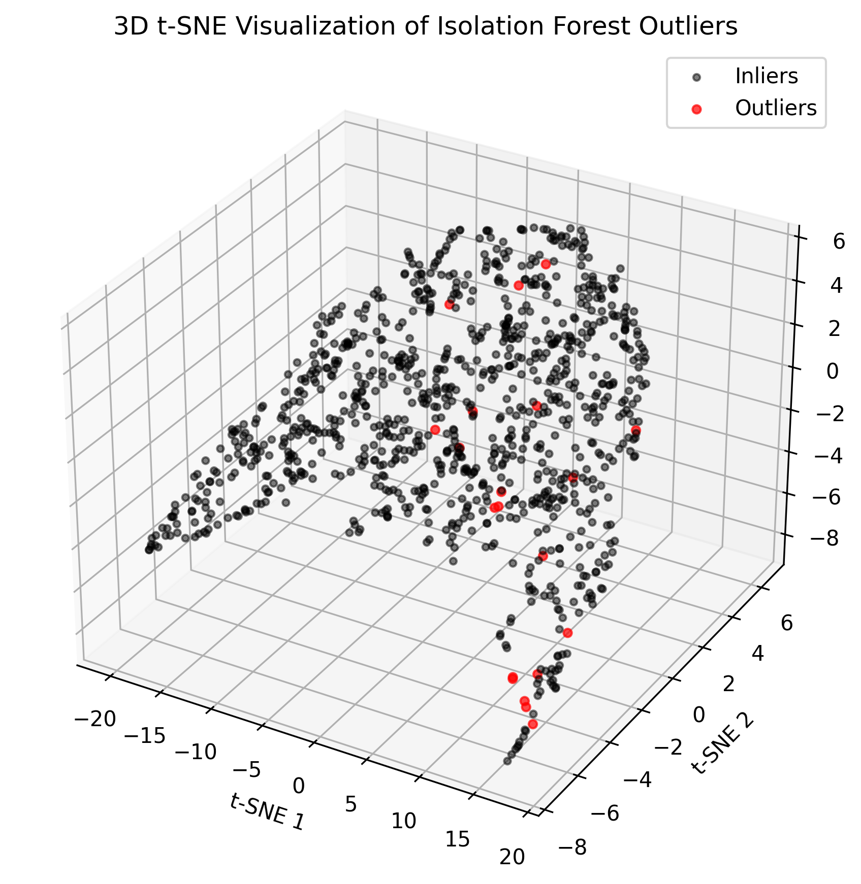

# **빅데이터와 금융자료분석 프로젝트 (Team 4)**

**프로젝트 제목:** XGBoost 알고리즘 기반 은행 대출 부도 예측 모델 구축  
**팀원:** 강상묵(20259013), 김형환(20249132), 유석호(20249264), 이현준(20249349), 최영서(20249430), 최재필(20249433)

---

## 1. 프로젝트 개요

본 프로젝트는 Lending Club의 P2P 대출 데이터를 활용하여, 다양한 데이터 전처리 기법(결측치·이상치 처리, 특성 공학 등)과 머신러닝 알고리즘(이상치 검출, 차원 축소, XGBoost 등)을 적용하고, 실제 금융 데이터 분석을 통해 유의미한 시사점을 도출하는 것을 목표로 수행되었습니다.

**워크플로우:**
1. 데이터 구조 및 특성 파악 (EDA)
2. 데이터 전처리 (칼럼 가공·제거, 문자형 변수 인코딩, 결측치·이상치 처리, 변수 선택)
3. Gradient Boosting 계열 모델을 활용한 대출 연체 예측 모델 구축 및 성능 평가

---

## 2. 데이터 구조 및 특성 (EDA)

### 2.1 데이터 개요
- **출처:** 미국 P2P 대출 플랫폼 Lending Club (2007~2020)  
- **샘플 수:** 약 400,000건  
- **변수 수:** 27개 (수치형 12, 문자형 15)  
- **목적 변수:** 대출 상태 (Fully paid vs. Charged off)

### 2.2 수치형 변수 분석

*그림 설명: 수치형 변수 간 상관계수를 시각화한 히트맵. 전반적인 상관관계는 낮으나, 일부 변수는 변수 선택 단계에서 제외할 예정입니다.*

### 2.3 문자형 변수 분석

- 주요 변수  
  - **term:** 대출 기간  
  - **home_ownership:** 주택 소유 형태  
  - **purpose:** 대출 목적  
- **관찰 결과:** 신용 등급(grade)에 따른 부도율 상승 경향 확인  
- 일부 문자형 변수는 고유값 수가 많아 분석에서 제외 고려

*그림 설명: 주요 문자형 변수별 분포 및 연체 여부와의 관계.*

---

## 3. 데이터 전처리

1. **칼럼 변환 및 통합·제거**  
   - `zip_code`만 추출 후 `address` 컬럼 제거  
   - `term`을 수치형(개월)으로 변환  
   - 고유값 100개 이상 컬럼(`emp_title`, `issue_d`, `earliest_cr_line` 등) 제거  
   - 중복 또는 유추 가능한 컬럼(`grade`, `emp_length`) 제거

2. **문자형 변수 인코딩**  
   - 라벨 인코딩: 이진·순서형 변수(`purpose`, `grade`)  
   - 원-핫 인코딩: 기타 문자형 변수

3. **결측치 및 이상치 처리**  
   - 결측치: 중간값으로 대체  
   - 이상치: Isolation Forest로 상위 1% 이상치 제거

4. **변수 선택**  
   - Boruta 알고리즘을 적용하여 11개 변수(수치형·라벨 인코딩) 선택  
   - 최종 데이터: 문자형 변수 7개(원-핫 6 + 라벨 1), 수치형 변수 9개, 목적 변수 1개

*그림 설명: 이상치 제거 후 T-SNE 3차원 축소 결과.*

---

## 4. 모델 구축 및 평가

### 4.1 사용 알고리즘 및 오버샘플링

- **XGBoost:** 정규화 및 트리 구조 최적화 강점  
- **CatBoost:** 범주형 변수 자동 인식 기능  
- **LightGBM:** 빠른 학습 속도 및 낮은 메모리 사용  
- **Soft Voting:** CatBoost, LightGBM 예측 확률 평균 앙상블  
- **Stacking:** CatBoost, LightGBM 출력 결과를 로지스틱 회귀로 메타 학습  

> **오버샘플링:** ADASYN으로 훈련 데이터 클래스 불균형 해소

### 4.2 하이퍼파라미터 튜닝

- **방법:** RandomizedSearchCV  
- **평가지표:** F1-score (클래스 불균형 고려)

### 4.3 모델 성능 비교

| 모델          | F1 Score | ROC AUC  |
|---------------|----------|----------|
| XGBoost       | 0.9345   | 0.8967   |
| CatBoost      | 0.9350   | 0.9032   |
| LightGBM      | 0.9348   | 0.9068   |
| Soft Voting   | 0.9352   | 0.9061   |
| Stacking      | 0.9316   | 0.9068   |

> **결과:** 모든 모델 F1-score ≥ 0.93, ROC AUC ≈ 0.90로 높은 예측 성능 확인

*그림 설명: XGBoost 최종 모델의 혼동 행렬.*

*그림 설명: XGBoost 최종 모델의 Precision-Recall 커브.*

### 4.4 변수 중요도

*그림 설명: XGBoost 모델에서 주요하게 작용한 변수(대출 목적, 주거 형태, 이자율 등).* 

---

## 5. 결론 및 시사점

- **전처리 중요성:** 결측치·이상치 처리와 변수 선택이 모델 성능을 크게 좌우함
- **모델 성능:** Gradient Boosting 계열 모델이 금융 데이터 예측에 강력함을 확인
- **클래스 불균형 해결:** 오버샘플링 기법과 변수 선택 기법의 효율성 입증
- **실무 적용:** 실제 금융 데이터 분석 과정과 알고리즘 활용 방법에 대한 실질적 이해 달성

---

*최종 버전 완료: 문법 및 형식 일관성을 검토하였습니다.*

